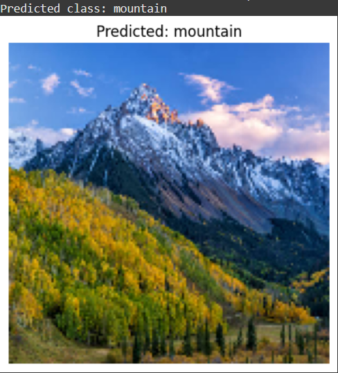

# 🧠 Scene Image Classifier using CNN

This project is a **Convolutional Neural Network (CNN)-based image classifier** that predicts the type of scene in a photograph. It was trained on the **Intel Image Classification Dataset** and identifies six natural and urban classes.

## 📌 Classes
- 🏙️ Buildings  
- 🌳 Forest  
- ❄️ Glacier  
- 🏔️ Mountain  
- 🌊 Sea  
- 🛣️ Street  

---

## 📁 Dataset
**Intel Image Classification Dataset**  
📎 [Download from Kaggle](https://www.kaggle.com/datasets/puneet6060/intel-image-classification)

---

## 🔧 Tech Stack
- Python 🐍
- TensorFlow/Keras 🤖
- Google Colab (GPU Training) ⚙️
- Matplotlib 📊

---

## 🧠 Model Summary
- CNN with multiple Conv2D and MaxPooling2D layers
- Activation: ReLU & Softmax
- Optimizer: Adam
- Categorical crossentropy loss
- Achieved **~98% training accuracy** and **~84% validation accuracy**

---

## 📊 Sample Prediction Output

> ✅ The model successfully predicted this image as **mountain**.

---

## ⚠️ Model Limitation

This model was trained exclusively on the **Intel Scene Classification Dataset**, which contains only 6 types of natural and urban scenes:

🏙️ Buildings | 🌳 Forest | ❄️ Glacier | 🏔️ Mountain | 🌊 Sea | 🛣️ Street

> 🔍 **Note**: This classifier will only work reliably on images that fall into one of these six categories. It is **not designed to detect arbitrary objects or scenes** outside this dataset (e.g., animals, humans, vehicles, etc.).

---

## 🚀 How to Use
1. Load the trained model `model.h5` using Keras or TensorFlow
2. Resize your image to **150x150 pixels**
3. Normalize and preprocess the image
4. Run `model.predict()` to classify the image
5. Match the output index with the class label

## 📦 Files Included
- `scene_classifier.ipynb` — Final Jupyter notebook
- `model.h5` — Trained CNN model
- `sample_image.jpg` — Test input
- `sample_output.png` — Prediction result

---

## 🧠 Download Model
Due to GitHub's file size restrictions, the trained model (`model.h5`) is hosted externally.
📥 [Click here to download model.h5 from Google Drive](https://drive.google.com/file/d/19C9Kawk1RZVt7ivApxkpRogLPkn3CSs5/view?usp=sharing)

---

## 📌 Future Improvements
- Deploy as a Streamlit web app
- Add confusion matrix & metrics
- Fine-tune with transfer learning
- Expand dataset diversity

---

## 🙋‍♂️ Author

**Ankit Kumar Panda**  
📫 GitHub: [ankitpanda030306](https://github.com/ankitpanda030306)  
🔗 ORCID: [0009-0009-3098-2336](https://orcid.org/0009-0009-3098-2336)

---

⭐ If you like this project, please consider giving it a star!
